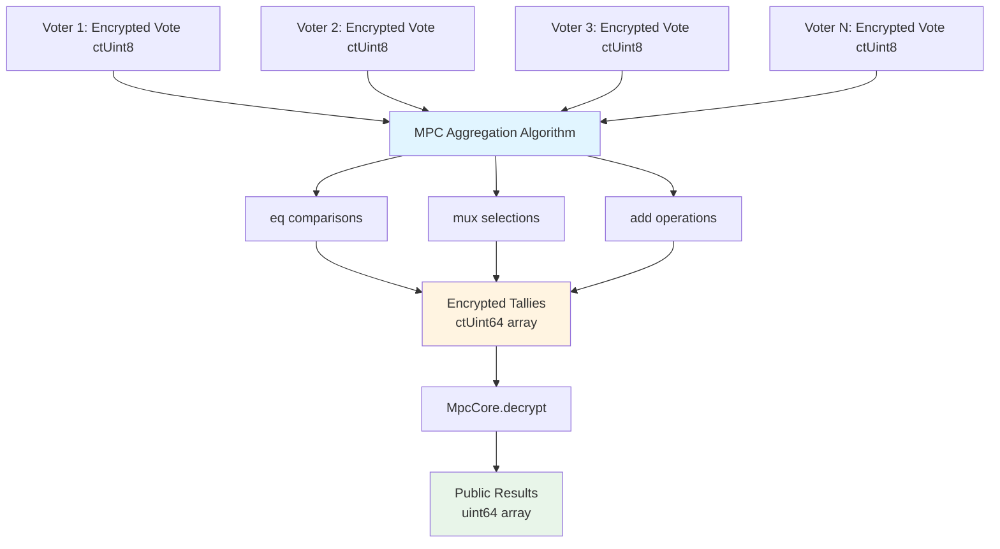
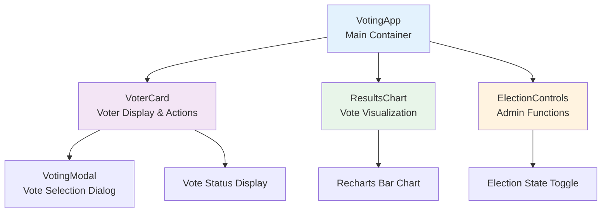
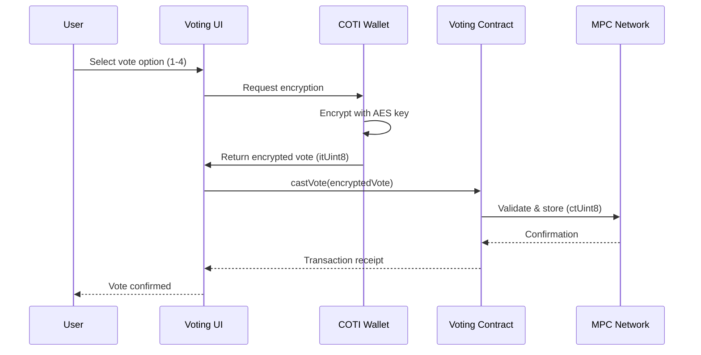

[](https://coti.io)
[](https://telegram.coti.io)
[](https://discord.coti.io)
[](https://twitter.coti.io)
[](https://youtube.coti.io)


# COTI Encrypted Voting Contract

A privacy-preserving voting system built on the COTI blockchain using Multi-Party Computation (MPC) for encrypted vote storage and tallying.

## Live Demo

Experience the app live on the COTI Testnet: [https://vote.demo.coti.io](https://vote.demo.coti.io)

## Overview

The COTI Voting Contract enables secure, private voting where individual votes remain encrypted throughout the entire process. Only the final aggregated results are revealed, ensuring voter privacy while maintaining result accuracy.

### Key Features

- **🔐 Encrypted Votes**: All votes are stored using COTI's MPC technology
- **👥 Voter Management**: Secure voter registration and validation
- **🗳️ Election Control**: Owner-controlled election state management
- **📊 Private Tallying**: Vote aggregation without revealing individual choices
- **✅ Comprehensive Testing**: Full test coverage for all functionality

## Contract Details

- **Contract Address (Testnet)**: `0xCc30E5c9d49b50316F0f9A4731E39434f082FAbf`
- **Network**: COTI Testnet (Chain ID: 7082400)
- **Solidity Version**: 0.8.19
- **License**: MIT

## Voting Question & Options

**Question**: "What is your favorite food?"

**Options**:
1. Chocolate
2. Raspberry  
3. Sandwich
4. Mango

---

## Project Structure

The project is organized into several key directories, each serving a specific purpose in the voting system architecture:

```plaintext
coti-voting-project/
├── contracts/
│   ├── COTIVotingContract.sol          # Main voting contract with MPC encryption
│   └── EncryptedMedicalRecords.sol     # Reference implementation for encryption patterns
├── client/
│   ├── src/
│   │   ├── components/                 # React UI components
│   │   │   ├── VoterCard.tsx          # Individual voter display component
│   │   │   ├── VotingModal.tsx        # Vote selection dialog
│   │   │   ├── ResultsChart.tsx       # Vote results visualization
│   │   │   ├── ElectionControls.tsx   # Admin election management
│   │   │   └── ui/                    # shadcn/ui component library
│   │   ├── hooks/
│   │   │   ├── useVotingContract.ts   # Blockchain integration hook
│   │   │   └── use-toast.ts           # Toast notification hook
│   │   ├── pages/
│   │   │   ├── VotingApp.tsx          # Main voting application page
│   │   │   └── Admin.tsx              # Admin dashboard page
│   │   └── lib/
│   │       ├── utils.ts               # Utility functions
│   │       └── queryClient.ts         # TanStack Query configuration
│   ├── index.html                      # Application entry point
│   └── vite.config.ts                  # Vite build configuration
├── test/
│   ├── COTIVotingContract.test.js      # Unit tests (19 tests)
│   ├── COTIVotingIntegration.test.js   # Integration tests (11 tests)
│   ├── PerUserEncryption.test.js       # Per-user encryption tests (15+ tests)
│   ├── testnet.test.js                 # Basic testnet validation (8 tests)
│   ├── testnet-comprehensive.test.js   # Extended testnet tests (9 tests)
│   └── README.md                       # Testing documentation
├── scripts/
│   ├── deploy.js                       # Contract deployment script
│   ├── test-connection.js              # Network connectivity test
│   ├── test-integration-manual.js      # Manual integration testing
│   └── utils/
│       └── rpc-utils.js                # RPC retry and reliability utilities
├── artifacts/                          # Compiled contract artifacts
├── cache/                              # Hardhat compilation cache
├── .env                                # Environment variables (not in git)
├── .env.example                        # Environment variable template
├── hardhat.config.js                   # Hardhat network and compiler configuration
├── vite.config.ts                      # Vite bundler configuration
├── package.json                        # Project dependencies and scripts
├── tsconfig.json                       # TypeScript configuration
└── README.md                           # This documentation file
```

### Directory Descriptions

#### `contracts/`
Contains Solidity smart contracts for the voting system.

- **COTIVotingContract.sol**: The main voting contract implementing encrypted vote storage, voter management, election state control, and vote aggregation using COTI's MPC technology. Key features include:
  - Per-user vote encryption using `MpcCore.offBoard()`
  - Voter authorization pattern for vote tallying
  - Encrypted vote aggregation without revealing individual votes
  - Comprehensive access control and state management

- **EncryptedMedicalRecords.sol**: Reference implementation demonstrating COTI's encryption patterns, used as a guide for implementing per-user encryption in the voting contract.

#### `client/`
React-based web application providing a user interface for the voting system.

- **VotingApp.tsx**: Main application component that orchestrates the voting experience. Manages:
  - Multiple voter accounts with wallet switching
  - Real-time election state monitoring
  - Vote submission and confirmation
  - Results visualization after election closes
  - Integration with COTI blockchain via custom hooks

- **useVotingContract.ts**: Custom React hook that abstracts blockchain interactions. Provides:
  - Wallet management for multiple voter accounts
  - Vote encryption using COTI SDK (`wallet.encryptValue()`)
  - Contract function calls (castVote, getResults, etc.)
  - Transaction state management and error handling
  - Automatic re-fetching of contract state

- **Component Architecture**: Built with React 18, TypeScript, and shadcn/ui components for a modern, accessible interface. Uses TanStack Query for efficient state management and caching.

#### `test/`
Comprehensive test suite covering unit, integration, and testnet scenarios.

- **COTIVotingContract.test.js**: Core unit tests validating contract functionality including voter registration, election state management, access control, and error handling.

- **COTIVotingIntegration.test.js**: End-to-end integration tests simulating complete voting workflows with multiple voters.

- **PerUserEncryption.test.js**: Specialized tests for per-user encryption features, including vote casting with different addresses, vote retrieval access control, authorization patterns, and encrypted vote aggregation.

- **testnet.test.js** & **testnet-comprehensive.test.js**: Live network tests validating deployed contract behavior on COTI testnet.

#### `scripts/`
Deployment and utility scripts for contract management.

- **deploy.js**: Production-ready deployment script with retry logic, gas optimization, and error handling for COTI testnet deployment.

- **utils/rpc-utils.js**: Reliability utilities providing retry mechanisms with exponential backoff for RPC calls, transaction confirmation, and network connectivity checks.

### Key Configuration Files

- **hardhat.config.js**: Configures Hardhat development environment with COTI testnet settings, compiler options, and network parameters.

- **vite.config.ts**: Configures Vite bundler for the React application with TypeScript support, path aliases, and development server settings.

- **package.json**: Defines project dependencies, scripts, and metadata. Includes both contract development tools (Hardhat, ethers.js) and frontend dependencies (React, Vite, TanStack Query).

- **.env.example**: Template for environment variables including contract addresses, RPC endpoints, deployer private keys, and voter account credentials.

---

## Smart Contract Architecture

### Core Components

#### Voter Management
- **Voter Registration**: Only contract owner can register voters
- **Voter Validation**: Prevents duplicate registrations and invalid addresses
- **Voter Information**: Stores encrypted voter data with privacy preservation

#### Election State Management
- **Election Control**: Owner can open/close elections
- **State Validation**: Prevents invalid state transitions
- **Access Control**: Enforces proper permissions for all operations

#### Encrypted Voting System
- **MPC Integration**: Uses COTI's Multi-Party Computation for vote encryption
- **Vote Storage**: Encrypted votes stored on-chain without revealing content
- **Vote Validation**: Ensures only valid vote options (1-4) are accepted

#### Per-User Encryption

The voting contract implements a sophisticated per-user encryption architecture that ensures each voter's choice remains private while enabling secure vote tallying. This pattern follows COTI's MPC best practices for privacy-preserving applications.

**Encryption Flow:**

When a voter casts their vote, the following encryption process occurs:

1. **Client-Side Encryption**: The voter's choice (1-4) is encrypted on the client using their wallet's encryption key
2. **Validation**: The contract validates the encrypted input using `MpcCore.validateCiphertext()`, converting it to a `gtUint8` (garbled/temporary encrypted value)
3. **Generic Storage**: The validated vote is converted to generic ciphertext using `MpcCore.offBoard()` and stored as `ctUint8`

```solidity
function castVote(itUint8 calldata encryptedVote) public onlyRegisteredVoter electionOpen {
    // Validate the encrypted input and convert to gtUint8
    gtUint8 validatedVote = MpcCore.validateCiphertext(encryptedVote);
    
    // Store with generic encryption (not tied to any specific user)
    ctUint8 storedVote = MpcCore.offBoard(validatedVote);
    
    // Store the encrypted vote
    voters[msg.sender].encryptedVote = storedVote;
    voters[msg.sender].hasVoted = true;
    
    emit VoteCast(msg.sender);
}
```

**Vote Retrieval Pattern:**

Voters can retrieve and verify their own encrypted vote using the `getMyVote()` function, which re-encrypts the vote specifically for the requesting voter:

```solidity
function getMyVote() public onlyRegisteredVoter returns (ctUint8) {
    // Check that voter has cast a vote
    if (!voters[msg.sender].hasVoted) revert VoterHasNotVoted(msg.sender);
    
    // Load the generically encrypted vote
    gtUint8 gtVote = MpcCore.onBoard(voters[msg.sender].encryptedVote);
    
    // Re-encrypt specifically for this voter (same pattern as medical records)
    ctUint8 voteForVoter = MpcCore.offBoardToUser(gtVote, msg.sender);
    
    // Return voter-specific encrypted vote
    return voteForVoter;
}
```

The `MpcCore.offBoardToUser()` function ensures that only the specified voter can decrypt their vote on the client side, maintaining privacy while allowing vote verification.

**Key Privacy Features:**

- **Generic Storage**: Votes are stored as generic ciphertext (`ctUint8`), not tied to any specific user's encryption key
- **User-Specific Retrieval**: When retrieved, votes are re-encrypted specifically for the requesting voter using `offBoardToUser()`
- **Access Control**: Only the voter who cast the vote can retrieve it (enforced by `onlyRegisteredVoter` modifier and `msg.sender` check)
- **No Plaintext Exposure**: Votes remain encrypted throughout their lifecycle; only the voter can decrypt their own vote on the client

This architecture mirrors COTI's medical records pattern, where patient data is stored generically but can be securely shared with authorized parties (doctors) through re-encryption.

#### Authorization Pattern

To enable vote tallying while preserving individual privacy, the contract implements an authorization mechanism where voters explicitly grant the contract owner permission to read their encrypted votes for aggregation purposes.

**Why Authorization is Needed:**

Since votes are stored as generic ciphertext, the contract owner cannot directly access individual votes for tallying. The authorization pattern solves this by allowing voters to grant read access to the owner, similar to how patients authorize doctors to access medical records in COTI's healthcare examples.

**Authorization Function:**

```solidity
function authorizeOwnerToReadVote() public onlyRegisteredVoter {
    require(!voters[msg.sender].hasAuthorizedOwner, "Owner already authorized");
    
    voters[msg.sender].hasAuthorizedOwner = true;
    
    emit OwnerAuthorized(msg.sender);
}
```

**Automatic Authorization:**

For convenience, the contract automatically authorizes the owner when a voter casts or changes their vote:

```solidity
// Automatically authorize owner when casting vote
if (!voters[msg.sender].hasAuthorizedOwner) {
    voters[msg.sender].hasAuthorizedOwner = true;
    emit OwnerAuthorized(msg.sender);
}
```

**Privacy Guarantees:**

- **Explicit Consent**: Voters must authorize the owner before their votes can be included in tallying
- **Limited Scope**: Authorization only grants access for aggregation purposes, not for revealing individual votes
- **Transparent Process**: The `OwnerAuthorized` event provides transparency about authorization status
- **Aggregation Only**: Even with authorization, the owner can only use votes in encrypted MPC operations, never decrypt individual votes

---

#### Vote Aggregation

The contract implements a sophisticated vote aggregation algorithm that tallies encrypted votes without ever decrypting individual choices. This process uses COTI's MPC operations to perform computations on encrypted data, ensuring complete privacy preservation.

**Aggregation Algorithm:**

The `_aggregateVotes()` function processes all votes through the following steps:

1. **Initialize Tallies**: Create encrypted counters for each voting option (1-4), initialized to 0
2. **Iterate Through Voters**: Process each registered voter who has cast a vote
3. **Authorization Check**: Verify that the voter has authorized the owner to read their vote
4. **Load Encrypted Vote**: Retrieve the voter's encrypted vote from storage
5. **Compare with Each Option**: For each voting option, check if the vote matches using encrypted comparison
6. **Increment Tally**: Add 1 to the matching option's tally (all operations performed on encrypted values)
7. **Store Updated Tally**: Save the updated encrypted tally back to storage

**MPC Operations Used:**

The aggregation process relies on three core MPC operations:

- **`MpcCore.eq(a, b)`**: Encrypted equality comparison - returns encrypted boolean indicating if two encrypted values are equal
- **`MpcCore.mux(condition, trueValue, falseValue)`**: Encrypted multiplexer - selects between two encrypted values based on an encrypted condition
- **`MpcCore.add(a, b)`**: Encrypted addition - adds two encrypted values without decryption

**Aggregation Code Example:**

```solidity
// For each voting option (1-4), check if this vote matches and add to tally
for (uint8 optionId = 1; optionId <= 4; optionId++) {
    // Create encrypted version of the option ID for comparison
    gtUint8 optionValue = MpcCore.setPublic8(optionId);
    
    // Check if the vote equals this option (returns encrypted boolean)
    gtBool isMatch = MpcCore.eq(encryptedVote, optionValue);
    
    // Convert boolean to uint64 (1 if match, 0 if not)
    gtUint64 one = MpcCore.setPublic64(1);
    gtUint64 zero = MpcCore.setPublic64(0);
    gtUint64 voteIncrement = MpcCore.mux(isMatch, one, zero);
    
    // Load current tally and add the increment
    gtUint64 currentTally = MpcCore.onBoard(voteTallies[optionId]);
    gtUint64 newTally = MpcCore.add(currentTally, voteIncrement);
    
    // Store the updated tally (generic ciphertext)
    ctUint64 updatedTally = MpcCore.offBoard(newTally);
    voteTallies[optionId] = updatedTally;
}
```

**Encrypted Vote Flow Diagram:**



**Privacy Preservation Guarantees:**

1. **No Individual Decryption**: Individual votes are never decrypted during aggregation
2. **Encrypted Comparisons**: All vote matching is performed on encrypted values using `eq()`
3. **Encrypted Arithmetic**: Tally increments use encrypted addition via `add()`
4. **Generic Storage**: Tallies are stored as generic ciphertext, not tied to any user
5. **Single Decryption Point**: Only the final aggregated tallies are decrypted, revealing only totals
6. **Authorization Required**: Voters must explicitly authorize their votes to be included in tallying

**When Aggregation Occurs:**

- **Automatic**: The `getResults()` function automatically calls `_aggregateVotes()` before returning results
- **Manual**: The `aggregateVotes()` function can be called explicitly after the election closes
- **Idempotent**: Aggregation can be called multiple times safely; tallies are recomputed from scratch each time

This aggregation approach ensures that the voting system maintains complete privacy while producing accurate, verifiable results.

---

### Key Functions

#### Owner Functions
```solidity
function addVoter(string memory name, address voterId) public onlyOwner
function toggleElection() public onlyOwner
```

#### Voter Functions
```solidity
function castVote(itUint8 calldata encryptedVote) public onlyRegisteredVoter electionOpen
function changeVote(itUint8 calldata newEncryptedVote) public onlyRegisteredVoter electionOpen
```

#### View Functions
```solidity
function getVotingQuestion() public pure returns (string memory)
function getVotingOptions() public view returns (VoteOption[4] memory)
function getResults() public electionClosed returns (VoteResult[4] memory)
function isVoterRegistered(address voterId) public view returns (bool)
```

### API Reference

This section provides detailed documentation for all contract functions, including the per-user encryption and authorization features.

#### Voter Retrieval Functions

##### `getMyVote()`

Allows a voter to retrieve their own encrypted vote for verification purposes.

```solidity
function getMyVote() public onlyRegisteredVoter returns (ctUint8)
```

**Access Control:**
- Only registered voters can call this function
- Voters can only retrieve their own vote (enforced by `msg.sender`)
- Voter must have already cast a vote

**Returns:**
- `ctUint8`: The voter's encrypted vote, re-encrypted specifically for the calling voter

**Usage Example:**
```solidity
// Voter retrieves their encrypted vote
ctUint8 myEncryptedVote = votingContract.getMyVote();

// On the client side, the voter can decrypt this using their private key
uint8 myVote = await wallet.decryptValue(myEncryptedVote);
console.log("My vote:", myVote); // 1, 2, 3, or 4
```

**Error Conditions:**
- Reverts with `VoterNotRegistered` if caller is not a registered voter
- Reverts with `VoterHasNotVoted` if voter hasn't cast a vote yet

**Privacy Notes:**
- The vote is re-encrypted specifically for the requesting voter using `MpcCore.offBoardToUser()`
- Only the voter who cast the vote can decrypt it on the client side
- This function does not reveal the vote to anyone else, including the contract owner

---

#### Authorization Functions

##### `authorizeOwnerToReadVote()`

Grants the contract owner permission to read the voter's encrypted vote for tallying purposes.

```solidity
function authorizeOwnerToReadVote() public onlyRegisteredVoter
```

**Access Control:**
- Only registered voters can call this function
- Can only be called once per voter (subsequent calls revert)

**Purpose:**
- Enables the contract owner to include the voter's vote in the aggregation process
- Required before votes can be tallied in `_aggregateVotes()`
- Follows COTI's authorization pattern from medical records example

**Usage Example:**
```solidity
// Voter explicitly authorizes owner to read their vote for tallying
votingContract.authorizeOwnerToReadVote();
```

**Automatic Authorization:**
- This function is automatically called when a voter casts or changes their vote
- Manual calling is optional but available for explicit authorization workflows

**Events Emitted:**
- `OwnerAuthorized(address indexed voter)`: Emitted when authorization is granted

**Privacy Notes:**
- Authorization only grants access for encrypted aggregation operations
- The owner cannot decrypt individual votes, only use them in MPC operations
- Individual vote privacy is maintained throughout the tallying process

#### Aggregation Functions

##### `aggregateVotes()`

Manually triggers the vote aggregation process to compute encrypted tallies for each voting option.

```solidity
function aggregateVotes() public electionClosed
```

**Access Control:**
- Can be called by anyone (public function)
- Can only be called after the election is closed

**When to Call:**
- After the election closes and before viewing results
- Optional: `getResults()` automatically calls this function
- Useful for pre-computing tallies before multiple result queries

**Process:**
1. Validates that voters are registered and votes have been cast
2. Initializes encrypted tally counters for each option (1-4)
3. Iterates through all voters who have cast votes
4. Checks authorization for each voter
5. Uses MPC operations (`eq()`, `mux()`, `add()`) to aggregate votes
6. Stores encrypted tallies for later decryption

**Usage Example:**
```solidity
// Close the election
votingContract.toggleElection();

// Manually aggregate votes
votingContract.aggregateVotes();

// Now results can be retrieved
VoteResult[4] memory results = votingContract.getResults();
```

**Error Conditions:**
- Reverts with `ElectionStillOpen` if election is still open
- Reverts with `NoVotersRegistered` if no voters are registered
- Reverts with `NoVotesCast` if no votes have been cast
- Reverts if any voter hasn't authorized the owner to read their vote

---

#### Result Functions

##### `viewResults()`

Returns the structure of voting results without decrypting vote counts. Useful for validating that aggregation has occurred.

```solidity
function viewResults() public view electionClosed returns (VoteResult[4] memory)
```

**Access Control:**
- Can be called by anyone (public view function)
- Can only be called after the election is closed

**Returns:**
- `VoteResult[4]`: Array of results with option IDs and labels, but vote counts set to 0

**Usage Example:**
```solidity
// Check result structure without decrypting
VoteResult[4] memory resultStructure = votingContract.viewResults();

for (uint i = 0; i < 4; i++) {
    console.log("Option", resultStructure[i].optionId, ":", resultStructure[i].optionLabel);
    // voteCount will be 0 since this function doesn't decrypt
}
```

**When to Use:**
- To verify that aggregation has been performed
- To check result structure without incurring decryption gas costs
- For testing and validation purposes

**Difference from `getResults()`:**
- `viewResults()` is a `view` function (read-only, no state changes)
- Does not trigger aggregation
- Does not decrypt vote counts (returns 0 for all counts)
- Lower gas cost since no decryption occurs

---

##### `getResults()`

Aggregates votes and returns decrypted voting results with actual vote counts.

```solidity
function getResults() public electionClosed returns (VoteResult[4] memory)
```

**Access Control:**
- Can be called by anyone (public function)
- Can only be called after the election is closed

**Returns:**
- `VoteResult[4]`: Array of results with option IDs, labels, and decrypted vote counts

**Process:**
1. Automatically calls `_aggregateVotes()` to ensure tallies are current
2. Loads encrypted tallies for each option
3. Decrypts each tally using `MpcCore.decrypt()`
4. Returns results with actual vote counts

**Usage Example:**
```solidity
// Close the election
votingContract.toggleElection();

// Get final results (automatically aggregates and decrypts)
VoteResult[4] memory results = votingContract.getResults();

for (uint i = 0; i < 4; i++) {
    console.log(
        "Option", results[i].optionId, 
        ":", results[i].optionLabel,
        "- Votes:", results[i].voteCount
    );
}
```

**Output Example:**
```plaintext
Option 1: Chocolate - Votes: 2
Option 2: Raspberry - Votes: 1
Option 3: Sandwich - Votes: 0
Option 4: Mango - Votes: 2
```

**Difference from `viewResults()`:**
- `getResults()` is a state-changing function (performs aggregation and decryption)
- Automatically triggers vote aggregation
- Returns actual decrypted vote counts
- Higher gas cost due to MPC operations and decryption

**Error Conditions:**
- Reverts with `ElectionStillOpen` if election is still open
- Reverts with `NoVotersRegistered` if no voters are registered
- Reverts if aggregation fails (e.g., unauthorized voters)

---

#### Complete Voting Workflow

Here's a complete example showing how all the functions work together:

```solidity
// 1. Owner registers voters
votingContract.addVoter("Alice", aliceAddress);
votingContract.addVoter("Bob", bobAddress);
votingContract.addVoter("Charlie", charlieAddress);

// 2. Voters cast their votes (with automatic authorization)
// Alice votes for option 1 (Chocolate)
uint8 aliceChoice = 1;
itUint8 aliceEncryptedVote = await aliceWallet.encryptValue(
    aliceChoice,
    contractAddress,
    "castVote"
);
await votingContract.connect(alice).castVote(aliceEncryptedVote);

// Bob votes for option 2 (Raspberry)
uint8 bobChoice = 2;
itUint8 bobEncryptedVote = await bobWallet.encryptValue(
    bobChoice,
    contractAddress,
    "castVote"
);
await votingContract.connect(bob).castVote(bobEncryptedVote);

// 3. Voters can verify their own votes
ctUint8 aliceVoteCheck = await votingContract.connect(alice).getMyVote();
uint8 aliceDecrypted = await aliceWallet.decryptValue(aliceVoteCheck);
console.log("Alice's vote:", aliceDecrypted); // 1

// 4. Owner closes the election
await votingContract.toggleElection();

// 5. Get aggregated results (automatically aggregates and decrypts)
VoteResult[4] memory results = await votingContract.getResults();

// 6. Display results
for (uint i = 0; i < 4; i++) {
    console.log(
        results[i].optionLabel, 
        "received", 
        results[i].voteCount, 
        "votes"
    );
}
```

**Key Points:**
- Votes are encrypted on the client before submission
- Authorization is automatic when casting votes
- Individual votes remain private throughout the process
- Only aggregated results are revealed after election closes
- Voters can verify their own votes at any time

---

### Custom Errors

- `VoterAlreadyRegistered(address voter)`: Prevents duplicate voter registration
- `VoterNotRegistered(address voter)`: Ensures only registered voters can vote
- `InvalidVoterAddress()`: Rejects zero addresses
- `EmptyVoterName()`: Requires non-empty voter names
- `ElectionClosed()`: Prevents voting when election is closed
- `ElectionStillOpen()`: Prevents result access during active election
- `OnlyOwnerAllowed()`: Restricts owner-only functions
- `NoVotesCast()`: Handles cases where no votes have been submitted
- `CannotCloseElectionWithoutVoters()`: Ensures voters exist before closing

---

## Web Application Architecture

The web application provides a modern, user-friendly interface for interacting with the COTI Voting Contract. Built with React 18 and TypeScript, it demonstrates best practices for blockchain integration and encrypted voting workflows.

### Technology Stack

**Frontend Framework:**
- **React 18**: Modern React with hooks and concurrent features
- **TypeScript**: Type-safe development with full IDE support
- **Vite**: Fast build tool and development server with HMR

**UI Framework:**
- **Radix UI**: Accessible, unstyled component primitives
- **Tailwind CSS**: Utility-first CSS framework for rapid styling
- **shadcn/ui**: Pre-built, customizable component library built on Radix UI

**State Management:**
- **TanStack Query (React Query)**: Powerful data synchronization and caching for blockchain state
- **React Hooks**: Local state management with useState and useEffect

**Blockchain Integration:**
- **@coti-io/coti-ethers**: COTI's extended ethers.js library with MPC encryption support
- **ethers.js**: Ethereum library for wallet management and contract interactions

### Component Architecture

The application follows a hierarchical component structure with clear separation of concerns:



**Component Responsibilities:**

**VotingApp** (`client/src/pages/VotingApp.tsx`)
- Main application container and orchestrator
- Manages multiple voter accounts with wallet switching
- Monitors real-time election state from blockchain
- Coordinates vote submission and confirmation flow
- Displays results visualization after election closes
- Integrates with COTI blockchain via `useVotingContract` hook

**VoterCard** (`client/src/components/VoterCard.tsx`)
- Displays individual voter information and status
- Shows whether voter has cast their vote
- Provides "Cast Vote" button to open voting modal
- Displays vote confirmation status
- Handles voter-specific interactions

**VotingModal** (`client/src/components/VotingModal.tsx`)
- Dialog for selecting vote option (1-4)
- Presents voting options: Chocolate, Raspberry, Sandwich, Mango
- Handles vote submission with loading states
- Provides user feedback via toast notifications
- Manages modal open/close state

**ResultsChart** (`client/src/components/ResultsChart.tsx`)
- Visualizes vote tallies using Recharts bar chart
- Displays vote counts for each option
- Only visible after election closes
- Responsive design for various screen sizes

**ElectionControls** (`client/src/components/ElectionControls.tsx`)
- Admin interface for election management
- Toggle button to open/close election
- Displays current election state
- Owner-only functionality (requires owner wallet)

---

### Blockchain Integration

The application integrates with the COTI blockchain through a custom React hook that abstracts all blockchain interactions and encryption logic.

**useVotingContract Hook** (`client/src/hooks/useVotingContract.ts`)

The hook provides the following exports:

```typescript
{
  voters: VoterAccount[],        // Array of configured voter accounts
  castVote: (voterName, option) => Promise<TransactionReceipt>,
  checkIfVoted: (voterName) => Promise<boolean>,
  contractAddress: string        // Deployed contract address
}
```

**Wallet Management:**

The hook manages multiple voter wallets, each configured with:
- Private key for transaction signing
- AES key for MPC encryption/decryption
- Connection to COTI testnet RPC endpoint

```typescript
const voters = useMemo<VoterAccount[]>(() => {
  const voterAccounts = [
    { name: 'Bob', privateKey: env.VITE_BOB_PK, aesKey: env.VITE_BOB_AES_KEY },
    { name: 'Bea', privateKey: env.VITE_BEA_PK, aesKey: env.VITE_BEA_AES_KEY },
    // ... additional voters
  ];

  return voterAccounts
    .filter(account => account.privateKey && account.aesKey)
    .map(account => {
      const provider = new ethers.JsonRpcProvider(rpcUrl);
      const wallet = new Wallet(account.privateKey, provider);
      wallet.setUserOnboardInfo({ aesKey: account.aesKey });
      return { ...account, wallet };
    });
}, [rpcUrl]);
```

**Vote Encryption Flow:**

When a voter casts their vote, the following encryption process occurs on the client:



**Encryption Steps:**

1. **User Selection**: Voter selects option (1-4) in the UI
2. **Wallet Retrieval**: Get the voter's configured wallet with AES key
3. **Value Encryption**: Encrypt the vote using COTI SDK's `wallet.encryptValue()`
4. **Function Selector**: Get the `castVote` function selector for encryption context
5. **Encrypted Payload**: Create encrypted input structure (ciphertext + signature)
6. **Transaction Submission**: Send encrypted vote to contract
7. **Confirmation**: Wait for transaction to be mined and confirmed

```typescript
const encryptVote = async (voteOption: number, wallet: Wallet) => {
  const contract = getContract(wallet);
  const castVoteSelector = contract.interface.getFunction('castVote')?.selector;
  
  // Encrypt the vote value using the wallet's encryptValue method
  const encryptedValue = await wallet.encryptValue(
    voteOption,
    contractAddress,
    castVoteSelector,
  );
  
  return encryptedValue;
};

const castVote = async (voterName: string, voteOption: number) => {
  const wallet = getVoterWallet(voterName);
  const encryptedVote = await encryptVote(voteOption, wallet);
  const contract = getContract(wallet);
  
  // Send transaction with encrypted vote
  const tx = await contract.castVote(encryptedVote, {
    gasLimit: 15000000,
    gasPrice: ethers.parseUnits('10', 'gwei'),
  });
  
  // Wait for confirmation
  const receipt = await tx.wait();
  return receipt;
};
```

**Transaction Submission and Confirmation:**

The application handles the complete transaction lifecycle:

1. **Gas Configuration**: Sets appropriate gas limit (15M) and gas price (10 gwei) for COTI testnet
2. **Transaction Broadcast**: Submits encrypted vote transaction to the network
3. **Pending State**: Shows loading indicator while transaction is pending
4. **Confirmation Wait**: Uses `tx.wait()` to wait for transaction to be mined
5. **Success Feedback**: Displays success toast notification with transaction details
6. **State Refresh**: Automatically refetches contract state to update UI
7. **Error Handling**: Catches and displays user-friendly error messages

---

### Environment Configuration

The web application requires several environment variables to connect to the COTI blockchain and manage voter accounts.

**Required Environment Variables:**

```env
# Contract Configuration
VITE_CONTRACT_ADDRESS=0xCc30E5c9d49b50316F0f9A4731E39434f082FAbf

# Network Configuration
VITE_APP_NODE_HTTPS_ADDRESS=https://testnet.coti.io/rpc

# Voter Account: Bob
VITE_BOB_PK=d157bf9f861c63a3d9e9e9e5c72375567015f6dd780ea109942bda749691800f
VITE_BOB_AES_KEY=3de2c499712a4968b0a584e7d0501a46

# Voter Account: Bea
VITE_BEA_PK=108804f6feeae81fe35a11423fda4937f47a72e30082bb2fa6883c62a49e5d6e
VITE_BEA_AES_KEY=5f1c9d2dcbd7808ba7f148c5fbc68a5b

# Voter Account: Charlie
VITE_CHARLIE_PK=a9fb0479056257c5f748a77f3a5c7292025fef913218a85e5f2a6636fa30973b
VITE_CHARLIE_AES_KEY=c6422eee51e3f270c389e8128423d511

# Voter Account: David
VITE_DAVID_PK=8c23334784ab8afff4b3888c82c2fc26658ed82312cf8623764335c5af398ecf
VITE_DAVID_AES_KEY=b1d52ffa8bc41ee11159d885ec87c559

# Voter Account: Ethan
VITE_ETHAN_PK=0eedd3fa4aa456aac6c5616743534834ed2df4342a73dbb6774ebb1bc0299d4e
VITE_ETHAN_AES_KEY=e7b84c210a5196668cb47e6b26cedba2
```

**Environment Variable Descriptions:**

- **VITE_CONTRACT_ADDRESS**: Address of the deployed COTIVotingContract on testnet
- **VITE_APP_NODE_HTTPS_ADDRESS**: RPC endpoint URL for COTI testnet
- **VITE_[VOTER]_PK**: Private key for each voter account (used for transaction signing)
- **VITE_[VOTER]_AES_KEY**: AES encryption key for each voter (used for MPC encryption/decryption)

**Example .env Structure:**

```env
# Copy .env.example to .env and fill in your values
# Never commit .env to version control

# Contract address from deployment
VITE_CONTRACT_ADDRESS=your_contract_address_here

# COTI testnet RPC (default provided)
VITE_APP_NODE_HTTPS_ADDRESS=https://testnet.coti.io/rpc

# Configure at least one voter account to use the app
VITE_BOB_PK=your_voter_private_key
VITE_BOB_AES_KEY=your_voter_aes_key
```

**Security Notes:**
- Never commit `.env` files to version control
- Private keys and AES keys should be kept secure
- Use `.env.example` as a template without real credentials
- Each voter needs both a private key and AES key for full functionality

---

### Development Commands

**Install Dependencies:**
```bash
npm install
```
Installs all required packages including React, TypeScript, Vite, COTI SDK, and UI libraries.

**Start Development Server:**
```bash
npm run dev
```
Starts the Vite development server with:
- Hot Module Replacement (HMR) for instant updates
- TypeScript compilation and type checking
- Runs on `http://localhost:5173` by default
- Automatic browser refresh on file changes

**Build for Production:**
```bash
npm run build
```
Creates an optimized production build:
- TypeScript compilation with type checking
- Vite bundling and minification
- Tree-shaking to remove unused code
- Output to `dist/` directory
- Optimized assets with content hashing

**Start Production Server:**
```bash
npm start
```
Serves the production build:
- Runs the built application from `dist/`
- Uses Node.js Express server
- Suitable for production deployment
- Serves static assets efficiently

---

## Testing Suite

### Test Coverage

Our comprehensive testing suite includes **50+ tests** across multiple categories:

#### 1. Unit Tests (`test/COTIVotingContract.test.js`)
- **19 tests** covering core functionality
- Contract initialization and configuration
- Voter registration and validation
- Election state management
- Access control and permissions
- Error handling and edge cases

#### 2. Integration Tests (`test/COTIVotingIntegration.test.js`)
- **11 tests** for end-to-end workflows
- Complete election lifecycle testing
- Multi-voter scenario validation
- Data consistency verification
- Security and access control testing

#### 3. Per-User Encryption Tests (`test/PerUserEncryption.test.js`)
- **15+ tests** for MPC encryption features with dual-mode support
- **Dual-Mode Testing Approach:**
  - **Local Mode**: Runs non-MPC tests (access control, state validation) on Hardhat network
  - **Testnet Mode**: Runs full MPC encryption tests when deployed to COTI testnet (chainId: 7082400)
  - Tests automatically detect network and skip incompatible tests

**Per-User Vote Casting Tests:**
- Multiple voters casting votes with different addresses
- Vote encryption verification for specific voters
- Vote storage with `ctUint8` type for per-user encryption
- `MpcCore.offBoardToUser()` usage verification
- Multiple voters with same/different vote options
- Vote changing with per-user encryption maintained
- Multiple vote changes with consistent encryption

**Vote Retrieval Access Control Tests:**
- `getMyVote()` access control enforcement
- Error handling for unregistered voters
- Error handling for voters who haven't voted
- State validation regardless of election state
- Owner access control (only if registered as voter)

**Authorization and Aggregation Tests:**
- Vote aggregation from multiple voters using different encryption keys
- Voter authorization pattern (similar to medical records)
- Accurate tally verification through `getResults()`
- Complete end-to-end voting flow (registration → voting → authorization → closing → results)
- Vote changes with accurate final tallies
- Mixed voting patterns (some voters not voting)
- Different voting distributions
- Results structure validation (IDs, labels, counts)

#### 4. Testnet Tests (`test/testnet.test.js`)
- **8 tests** against deployed contract
- Live network connectivity verification
- Real transaction testing
- Gas usage analysis
- Network information validation

#### 5. Comprehensive Testnet Tests (`test/testnet-comprehensive.test.js`)
- **9 tests** for extensive testnet validation
- Multi-voter registration workflows
- Election state transition testing
- Gas usage measurement
- Error handling validation

### Test Account Setup

To run per-user encryption tests on COTI testnet, you need to configure test accounts with both private keys and AES encryption keys in your `.env` file:

**Required Environment Variables:**

```env
# Test Account: Alice (Owner)
ALICE_PK=your_alice_private_key
ALICE_AES_KEY=your_alice_aes_key

# Test Account: Bob (Voter 1)
BOB_PK=your_bob_private_key
BOB_AES_KEY=your_bob_aes_key

# Test Account: Bea (Voter 2)
BEA_PK=your_bea_private_key
BEA_AES_KEY=your_bea_aes_key

# Test Account: Charlie (Voter 3) - Optional
CHARLIE_PK=your_charlie_private_key
CHARLIE_AES_KEY=your_charlie_aes_key
```

**Account Requirements:**

- **Private Keys**: Used for transaction signing and wallet authentication
- **AES Keys**: Required for MPC encryption/decryption operations with COTI SDK
- **Testnet Funds**: Each account needs sufficient COTI testnet tokens for gas fees
- **Minimum Accounts**: Alice, Bob, and Bea are required; Charlie is optional

**How AES Keys Work:**

The AES keys are used by the COTI SDK to encrypt and decrypt values on the client side before sending them to the MPC network. Each voter's AES key is set using:

```javascript
const wallet = new CotiWallet(privateKey, provider);
wallet.setUserOnboardInfo({ aesKey: aesKey });
```

This enables the wallet to:
- Encrypt vote values before casting: `wallet.encryptValue(voteOption, contractAddress, functionSelector)`
- Decrypt retrieved votes: `wallet.decryptValue(encryptedVote)`
- Participate in MPC operations with per-user encryption

---

### Running Tests

#### Local Tests
```bash
# Run all local tests
npm test

# Run specific test suites
npx hardhat test test/COTIVotingContract.test.js
npx hardhat test test/COTIVotingIntegration.test.js
```

#### Per-User Encryption Tests

The PerUserEncryption tests support dual-mode operation:

```bash
# Run on local network (non-MPC tests only)
npx hardhat test test/PerUserEncryption.test.js

# Run on COTI testnet with full MPC encryption (requires test accounts in .env)
npx hardhat test test/PerUserEncryption.test.js --network cotiTestnet

# Run with environment variables inline
ALICE_PK=your_key ALICE_AES_KEY=your_aes BOB_PK=your_key BOB_AES_KEY=your_aes BEA_PK=your_key BEA_AES_KEY=your_aes npx hardhat test test/PerUserEncryption.test.js --network cotiTestnet

# Run against a specific deployed contract
CONTRACT_ADDRESS=0xCc30E5c9d49b50316F0f9A4731E39434f082FAbf npx hardhat test test/PerUserEncryption.test.js --network cotiTestnet
```

#### Testnet Tests
```bash
# Set contract address and run testnet tests
CONTRACT_ADDRESS=0xCc30E5c9d49b50316F0f9A4731E39434f082FAbf npx hardhat test test/testnet.test.js --network cotiTestnet

# Run comprehensive testnet tests
CONTRACT_ADDRESS=0xCc30E5c9d49b50316F0f9A4731E39434f082FAbf npx hardhat test test/testnet-comprehensive.test.js --network cotiTestnet
```

**Note on Per-User Encryption Tests:**
- Local mode: All access control and state validation tests pass
- Testnet mode: Full MPC encryption tests require COTI testnet (chainId: 7082400)
- Tests automatically skip MPC-dependent tests when not on COTI testnet

---

## Deployment

This section provides comprehensive instructions for deploying the smart contract to COTI testnet and configuring the web application to interact with the deployed contract.

### Smart Contract Deployment

#### Prerequisites

Before deploying the smart contract, ensure you have:

1. **Node.js** (v16 or higher) installed
2. **npm** or **yarn** package manager
3. **Hardhat** development environment (installed via `npm install`)
4. **COTI Testnet Account** with sufficient funds for deployment
   - Get testnet tokens from the [COTI Faucet](https://faucet.coti.io)
   - Minimum recommended: 10 COTI for deployment and testing
5. **Private Key** for the deployer account (without 0x prefix)

#### Required Environment Variables

Create a `.env` file in the project root with the following variables:

```env
# Deployer Account Configuration
DEPLOYER_PRIVATE_KEY=your_deployer_private_key_here

# COTI Testnet RPC Endpoint
VITE_APP_NODE_HTTPS_ADDRESS=https://testnet.coti.io/rpc

# Optional: Deployer AES Key (for MPC operations during deployment)
AES_KEY=your_aes_key_here
```

**Environment Variable Descriptions:**

- **DEPLOYER_PRIVATE_KEY**: The private key of the account that will deploy the contract (without `0x` prefix)
  - This account must have sufficient COTI testnet tokens for gas fees
  - Keep this key secure and never commit it to version control
  - Example: `ae7f54c98460fed4c2ecb2e143f0e8110db534d390940f9f7b7048b94d614306`

- **VITE_APP_NODE_HTTPS_ADDRESS**: The RPC endpoint URL for COTI testnet
  - Default: `https://testnet.coti.io/rpc`
  - This endpoint is used by both deployment scripts and the web application

- **AES_KEY**: AES encryption key for the deployer account (optional for deployment, required for MPC operations)
  - Used if the deployer needs to interact with MPC features
  - Example: `8d41ade6e238d837bdbd44bac75dfac4`

**Setting Up Your .env File:**

1. Copy the example environment file:
   ```bash
   cp .env.example .env
   ```

2. Edit `.env` and replace the placeholder values with your actual credentials:
   ```bash
   nano .env  # or use your preferred editor
   ```

3. Verify your `.env` file is listed in `.gitignore` to prevent accidental commits

#### Step-by-Step Deployment Instructions

**Step 1: Install Dependencies**

```bash
npm install
```

This installs all required packages including Hardhat, ethers.js, and COTI SDK dependencies.

**Step 2: Verify Network Configuration**

Check that your `hardhat.config.js` includes the COTI testnet configuration:

```javascript
cotiTestnet: {
  url: process.env.VITE_APP_NODE_HTTPS_ADDRESS || "https://testnet.coti.io/rpc",
  chainId: 7082400,
  accounts: process.env.DEPLOYER_PRIVATE_KEY ? [process.env.DEPLOYER_PRIVATE_KEY] : [],
}
```

**Step 3: Test Network Connectivity**

Before deploying, verify you can connect to the COTI testnet:

```bash
node scripts/test-connection.js
```

This script checks:
- RPC endpoint connectivity
- Account balance
- Network information (chain ID, block number)

**Step 4: Deploy the Contract**

Run the deployment script:

```bash
npx hardhat run scripts/deploy.js --network cotiTestnet
```

**Expected Output:**

```plaintext
Deploying COTIVotingContract...
Deployer address: 0x841bcafec082e856709ae082f77c9783cae76163
Deployer balance: 15.5 COTI

Deployment transaction sent: 0x1234...
Waiting for confirmation...

✅ COTIVotingContract deployed successfully!
Contract address: 0xCc30E5c9d49b50316F0f9A4731E39434f082FAbf
Transaction hash: 0x1234...
Gas used: 3,000,000
Block number: 12345

Save this contract address for your .env configuration!
```

**Step 5: Save the Contract Address**

Copy the deployed contract address from the output. You'll need this for:
- Web application configuration (`.env` file)
- Running testnet tests
- Interacting with the contract

**Step 6: Verify Contract on Block Explorer (Optional)**

Visit the COTI testnet block explorer to verify your deployment:

```plaintext
https://explorer-testnet.coti.io/address/YOUR_CONTRACT_ADDRESS
```

You can view:
- Contract bytecode
- Transaction history
- Contract state
- Event logs

#### Deployment Features

The deployment script (`scripts/deploy.js`) includes several production-ready features:

- **Retry Logic**: Automatic retry with exponential backoff for failed RPC calls
- **Gas Optimization**: Optimized gas settings for COTI network (15M gas limit, 10 gwei gas price)
- **Error Handling**: Comprehensive error handling and logging for deployment failures
- **Balance Verification**: Checks deployer balance before attempting deployment
- **Transaction Monitoring**: Waits for transaction confirmation with retry logic
- **Deployment Verification**: Confirms contract deployment and retrieves contract address

#### Troubleshooting Deployment Issues

**Issue: "Insufficient funds for gas"**
- Solution: Get more testnet tokens from the COTI faucet
- Check your balance: `npx hardhat run scripts/test-connection.js`

**Issue: "Network connection timeout"**
- Solution: Verify RPC endpoint is correct in `.env`
- Try the test connection script: `node scripts/test-connection.js`
- Check your internet connection

**Issue: "Invalid private key"**
- Solution: Ensure private key is without `0x` prefix
- Verify the key is 64 hexadecimal characters
- Check for extra spaces or newlines in `.env`

**Issue: "Nonce too low" or "Nonce too high"**
- Solution: Wait a few minutes and try again
- Reset your account nonce by restarting Hardhat network
- Check for pending transactions on the block explorer

**Issue: "Contract deployment failed"**
- Solution: Check deployer account has sufficient balance
- Verify Solidity version compatibility (0.8.19)
- Review deployment logs for specific error messages
- Try increasing gas limit in deployment script

### Web Application Configuration

After successfully deploying the smart contract, you need to configure the web application to interact with your deployed contract.

#### Configuring the Contract Address

**Step 1: Update Web Application .env**

Navigate to the `client/` directory (or root if using a monorepo structure) and update your `.env` file with the deployed contract address:

```env
# Contract Configuration
VITE_CONTRACT_ADDRESS=0xCc30E5c9d49b50316F0f9A4731E39434f082FAbf

# Network Configuration (should match deployment)
VITE_APP_NODE_HTTPS_ADDRESS=https://testnet.coti.io/rpc
```

Replace `0xCc30E5c9d49b50316F0f9A4731E39434f082FAbf` with your actual deployed contract address from the deployment output.

**Step 2: Verify Configuration**

Ensure the RPC endpoint matches the network where you deployed the contract:
- **COTI Testnet**: `https://testnet.coti.io/rpc`
- **Chain ID**: 7082400

#### Voter Account Setup

The web application requires voter accounts to be configured with both private keys and AES encryption keys. Each voter needs these credentials to cast votes and interact with the encrypted voting system.

**Required Voter Accounts:**

The application supports up to 5 voter accounts. Configure at least one voter to use the application:

```env
# Voter Account: Bob
VITE_BOB_PK=d157bf9f861c63a3d9e9e9e5c72375567015f6dd780ea109942bda749691800f
VITE_BOB_AES_KEY=3de2c499712a4968b0a584e7d0501a46

# Voter Account: Bea
VITE_BEA_PK=108804f6feeae81fe35a11423fda4937f47a72e30082bb2fa6883c62a49e5d6e
VITE_BEA_AES_KEY=5f1c9d2dcbd7808ba7f148c5fbc68a5b

# Voter Account: Charlie
VITE_CHARLIE_PK=a9fb0479056257c5f748a77f3a5c7292025fef913218a85e5f2a6636fa30973b
VITE_CHARLIE_AES_KEY=c6422eee51e3f270c389e8128423d511

# Voter Account: David
VITE_DAVID_PK=8c23334784ab8afff4b3888c82c2fc26658ed82312cf8623764335c5af398ecf
VITE_DAVID_AES_KEY=b1d52ffa8bc41ee11159d885ec87c559

# Voter Account: Ethan
VITE_ETHAN_PK=0eedd3fa4aa456aac6c5616743534834ed2df4342a73dbb6774ebb1bc0299d4e
VITE_ETHAN_AES_KEY=e7b84c210a5196668cb47e6b26cedba2
```

**Voter Configuration Requirements:**

- **Private Key (PK)**: Used for signing transactions and wallet authentication
  - Must be a valid Ethereum private key (64 hexadecimal characters)
  - Account must have sufficient COTI testnet tokens for gas fees
  - Each voter needs ~0.1 COTI for voting transactions

- **AES Key**: Required for MPC encryption/decryption operations
  - Used by COTI SDK to encrypt votes before submission
  - Used to decrypt retrieved votes for verification
  - Must be a 32-character hexadecimal string

**Important Notes:**

- The voter accounts configured in the web app must be registered in the smart contract by the owner
- Each voter account must have testnet funds for transaction gas fees
- Private keys and AES keys should be kept secure and never committed to version control
- You can configure fewer than 5 voters; the app will only display configured accounts

#### Generating Private Keys and AES Keys

If you need to create new voter accounts, follow these instructions:

**Generating Private Keys:**

**Option 1: Using ethers.js (Recommended)**

```javascript
// Create a new file: scripts/generate-keys.js
const { ethers } = require('ethers');

// Generate a new random wallet
const wallet = ethers.Wallet.createRandom();

console.log('Address:', wallet.address);
console.log('Private Key:', wallet.privateKey.slice(2)); // Remove 0x prefix
console.log('Mnemonic:', wallet.mnemonic.phrase);
```

Run the script:
```bash
node scripts/generate-keys.js
```

**Option 2: Using OpenSSL**

```bash
# Generate a random 32-byte hex string
openssl rand -hex 32
```

**Option 3: Using MetaMask**

1. Create a new account in MetaMask
2. Export the private key (Settings → Security & Privacy → Reveal Private Key)
3. Remove the `0x` prefix from the key

**Generating AES Keys:**

AES keys are 128-bit (16-byte) random values represented as 32 hexadecimal characters:

**Option 1: Using Node.js crypto**

```javascript
// Create a new file: scripts/generate-aes-key.js
const crypto = require('crypto');

// Generate a random 16-byte (128-bit) AES key
const aesKey = crypto.randomBytes(16).toString('hex');

console.log('AES Key:', aesKey);
```

Run the script:
```bash
node scripts/generate-aes-key.js
```

**Option 2: Using OpenSSL**

```bash
# Generate a random 16-byte hex string
openssl rand -hex 16
```

**Option 3: Using Online Tools**

Visit a secure random hex generator (ensure it's HTTPS and reputable):
- Generate a 32-character hexadecimal string
- Use only for testnet/development purposes

**Complete Voter Setup Example:**

```bash
# 1. Generate private key and AES key
node scripts/generate-keys.js
node scripts/generate-aes-key.js

# 2. Fund the account with testnet tokens
# Visit https://faucet.coti.io and enter the generated address

# 3. Add to .env file
echo "VITE_NEW_VOTER_PK=generated_private_key" >> .env
echo "VITE_NEW_VOTER_AES_KEY=generated_aes_key" >> .env

# 4. Register the voter in the smart contract (as owner)
# Use the admin interface or call addVoter() directly
```

#### Registering Voters in the Contract

After configuring voter accounts in the web application, the contract owner must register each voter:

**Option 1: Using Hardhat Console**

```bash
npx hardhat console --network cotiTestnet
```

```javascript
const contract = await ethers.getContractAt(
  "COTIVotingContract",
  "0xCc30E5c9d49b50316F0f9A4731E39434f082FAbf"
);

// Register voters
await contract.addVoter("Bob", "0x48f9d5da4e224d965497f722555b0eebcbdf4ab6");
await contract.addVoter("Bea", "0xb2e02380dc1656778f531b713f895ecd47c5d132");
await contract.addVoter("Charlie", "0x90de80d53c1ea7dc5e512fd284f0b5c7317ac3cb");
```

**Option 2: Using the Admin Web Interface**

1. Configure the owner's private key and AES key in `.env`
2. Start the web application
3. Navigate to the Admin page
4. Use the "Add Voter" interface to register each voter

**Option 3: Using a Registration Script**

Create a script to register all voters at once:

```javascript
// scripts/register-voters.js
const hre = require("hardhat");

async function main() {
  const contractAddress = process.env.CONTRACT_ADDRESS;
  const contract = await hre.ethers.getContractAt("COTIVotingContract", contractAddress);

  const voters = [
    { name: "Bob", address: "0x48f9d5da4e224d965497f722555b0eebcbdf4ab6" },
    { name: "Bea", address: "0xb2e02380dc1656778f531b713f895ecd47c5d132" },
    { name: "Charlie", address: "0x90de80d53c1ea7dc5e512fd284f0b5c7317ac3cb" },
  ];

  for (const voter of voters) {
    console.log(`Registering ${voter.name}...`);
    const tx = await contract.addVoter(voter.name, voter.address);
    await tx.wait();
    console.log(`✅ ${voter.name} registered`);
  }
}

main().catch(console.error);
```

Run the script:
```bash
CONTRACT_ADDRESS=0xCc30E5c9d49b50316F0f9A4731E39434f082FAbf \
npx hardhat run scripts/register-voters.js --network cotiTestnet
```

#### Verifying Configuration

After configuring the web application, verify everything is set up correctly:

**Step 1: Check Environment Variables**

```bash
# Verify all required variables are set
cat .env | grep VITE_CONTRACT_ADDRESS
cat .env | grep VITE_APP_NODE_HTTPS_ADDRESS
cat .env | grep VITE_BOB_PK
```

**Step 2: Test Contract Connection**

Create a simple test script:

```javascript
// scripts/test-web-config.js
const { ethers } = require('ethers');
require('dotenv').config();

async function testConfig() {
  const provider = new ethers.JsonRpcProvider(process.env.VITE_APP_NODE_HTTPS_ADDRESS);
  const contract = await ethers.getContractAt(
    "COTIVotingContract",
    process.env.VITE_CONTRACT_ADDRESS
  );

  console.log("Contract Address:", process.env.VITE_CONTRACT_ADDRESS);
  console.log("Network:", await provider.getNetwork());
  console.log("Voting Question:", await contract.getVotingQuestion());
  console.log("✅ Configuration verified!");
}

testConfig().catch(console.error);
```

**Step 3: Start the Application**

```bash
npm run dev
```

If configuration is correct, you should see:
- Voter accounts listed in the UI
- Contract connection status
- Current election state

#### Configuration Troubleshooting

**Issue: "Contract not found" or "Invalid contract address"**
- Solution: Verify the contract address is correct and includes the `0x` prefix
- Check the contract was deployed to the same network as your RPC endpoint
- Verify the contract address on the block explorer

**Issue: "Voter account not showing in UI"**
- Solution: Ensure both `VITE_[VOTER]_PK` and `VITE_[VOTER]_AES_KEY` are set
- Check for typos in environment variable names
- Restart the development server after changing `.env`

**Issue: "Transaction failed: insufficient funds"**
- Solution: Fund voter accounts with testnet tokens from the faucet
- Each voter needs ~0.1 COTI for gas fees
- Check account balance on the block explorer

**Issue: "Voter not registered" error when voting**
- Solution: Register the voter in the contract using the owner account
- Verify the voter address matches the private key
- Check registration status: `contract.isVoterRegistered(voterAddress)`

**Issue: "Encryption failed" or "Invalid AES key"**
- Solution: Verify AES key is exactly 32 hexadecimal characters
- Regenerate AES key if corrupted
- Ensure no extra spaces or newlines in `.env`

---

### Web Application Deployment

After configuring the web application with your deployed contract and voter accounts, you can run the application in development mode or build it for production deployment.

#### Development Mode Setup

Development mode is ideal for testing, debugging, and local development with hot module replacement (HMR).

**Step 1: Install Dependencies**

```bash
npm install
```

This installs all required packages including:
- React 18 and React DOM
- TypeScript and type definitions
- Vite build tool
- COTI SDK (@coti-io/coti-ethers)
- UI libraries (Radix UI, Tailwind CSS, shadcn/ui)
- TanStack Query for state management

**Step 2: Configure Environment Variables**

Ensure your `.env` file is properly configured with:
- Contract address (`VITE_CONTRACT_ADDRESS`)
- RPC endpoint (`VITE_APP_NODE_HTTPS_ADDRESS`)
- At least one voter account with private key and AES key

**Step 3: Start Development Server**

```bash
npm run dev
```

**Expected Output:**

```
  VITE v5.0.0  ready in 500 ms

  ➜  Local:   http://localhost:5173/
  ➜  Network: http://192.168.1.100:5173/
  ➜  press h to show help
```

**Development Server Features:**

- **Hot Module Replacement (HMR)**: Instant updates when you modify code
- **Fast Refresh**: Preserves component state during updates
- **TypeScript Compilation**: Real-time type checking and error reporting
- **Source Maps**: Easy debugging with original source code
- **Automatic Browser Refresh**: Opens browser automatically on first run

**Step 4: Access the Application**

Open your browser and navigate to:
```
http://localhost:5173
```

You should see:
- List of configured voter accounts
- Current election state (open/closed)
- Vote casting interface for each voter
- Results chart (if election is closed)

**Development Mode Tips:**

- Use browser DevTools to inspect blockchain transactions
- Check the console for detailed error messages
- Monitor network requests to the RPC endpoint
- Use React DevTools extension for component debugging

#### Production Build Process

Building for production creates an optimized, minified version of the application suitable for deployment to hosting platforms.

**Step 1: Build the Application**

```bash
npm run build
```

**Build Process:**

1. **TypeScript Compilation**: Compiles all `.ts` and `.tsx` files with type checking
2. **Vite Bundling**: Bundles all JavaScript, CSS, and assets
3. **Code Minification**: Minifies JavaScript and CSS for smaller file sizes
4. **Tree Shaking**: Removes unused code to reduce bundle size
5. **Asset Optimization**: Optimizes images and other static assets
6. **Content Hashing**: Adds hashes to filenames for cache busting

**Expected Output:**

```
vite v5.0.0 building for production...
✓ 1250 modules transformed.
dist/index.html                   0.45 kB │ gzip:  0.30 kB
dist/assets/index-a1b2c3d4.css   45.67 kB │ gzip: 12.34 kB
dist/assets/index-e5f6g7h8.js   234.56 kB │ gzip: 78.90 kB
✓ built in 3.45s
```

**Build Output Location:**

All production files are generated in the `dist/` directory:

```
dist/
├── index.html              # Main HTML file
├── assets/
│   ├── index-[hash].css   # Bundled and minified CSS
│   ├── index-[hash].js    # Bundled and minified JavaScript
│   └── [other assets]     # Images, fonts, etc.
└── favicon.png            # Application icon
```

**Step 2: Test Production Build Locally**

Before deploying, test the production build locally:

```bash
npm start
```

This starts a local server serving the production build from the `dist/` directory.

**Expected Output:**

```
Server running at http://localhost:3000
Serving static files from: dist/
```

Access the application at `http://localhost:3000` and verify:
- All features work correctly
- No console errors
- Transactions complete successfully
- UI renders properly

**Step 3: Verify Build Quality**

Check the build output for:
- **Bundle Size**: JavaScript bundle should be < 500 KB (gzipped)
- **CSS Size**: Stylesheet should be < 50 KB (gzipped)
- **No Errors**: Build process completes without errors
- **No Warnings**: Address any TypeScript or build warnings


## Gas Usage Analysis

Based on testnet measurements:

| Operation | Gas Used | Description |
|-----------|----------|-------------|
| Contract Deployment | ~3,000,000 | Initial contract deployment |
| Voter Registration | ~126,269 | Register a new voter |
| Election Toggle (Close) | ~29,749 | Close an active election |
| Election Toggle (Open) | ~27,641 | Reopen a closed election |
| View Functions | <50,000 | Read-only operations |

---

## Security Features

### Access Control
- **Owner-only functions**: Voter registration and election control
- **Voter-only functions**: Vote casting and changing
- **State-based restrictions**: Voting only during open elections

### Input Validation
- **Address validation**: Prevents zero addresses
- **Name validation**: Requires non-empty, non-whitespace names
- **Vote validation**: Ensures votes are within valid range (1-4)
- **Duplicate prevention**: Prevents duplicate voter registration

### Privacy Protection
- **Encrypted storage**: All votes stored using MPC encryption
- **Private aggregation**: Vote tallying without revealing individual votes
- **Result-only decryption**: Only final results are made public

---

## Error Handling & Reliability

### RPC Reliability
- **Retry mechanisms**: Automatic retry with exponential backoff
- **Timeout handling**: Proper timeout configuration for network calls
- **Connection validation**: Network connectivity checks before operations

### Transaction Reliability
- **Gas optimization**: Appropriate gas limits and pricing
- **Transaction monitoring**: Wait for confirmation with retry logic
- **Error recovery**: Graceful handling of failed transactions

---

## Development Utilities

### RPC Utils (`scripts/utils/rpc-utils.js`)
- `retryRpcCall()`: Retry RPC calls with exponential backoff
- `waitForTransactionWithRetry()`: Wait for transaction confirmation
- `sendTransactionWithRetry()`: Send transactions with retry logic
- `checkNetworkConnectivity()`: Validate network connection

### Deployment Scripts
- `scripts/deploy.js`: Main deployment script with retry logic
- `scripts/deploy-DateGame.js`: Reference implementation

---

## Requirements Compliance

The contract and tests fulfill all specified requirements:

### Core Requirements (1.1, 2.1, 3.1, 4.1)
- ✅ Voter registration and vote casting
- ✅ Election state management  
- ✅ Vote privacy and result accuracy
- ✅ Comprehensive unit test coverage

### Integration Requirements (1.3, 2.4, 4.2)
- ✅ Complete voting workflow testing
- ✅ Multi-voter scenarios with result verification
- ✅ Access control and security measures
- ✅ End-to-end integration test coverage

---

## Contributing

1. Fork the repository
2. Create a feature branch
3. Add tests for new functionality
4. Ensure all tests pass
5. Submit a pull request

---

## License

MIT License - see LICENSE file for details.

---


**Note**: This contract is deployed on COTI Testnet for demonstration purposes. For production use, additional security audits and testing are recommended.